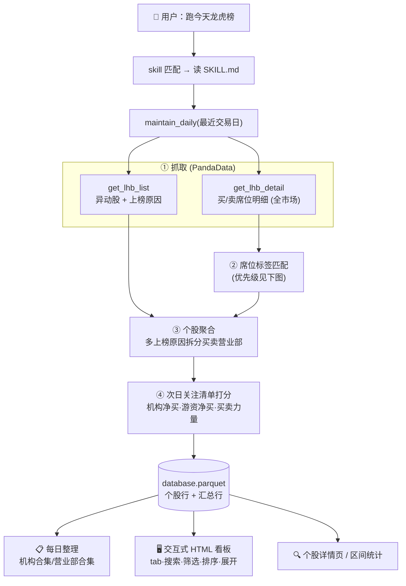
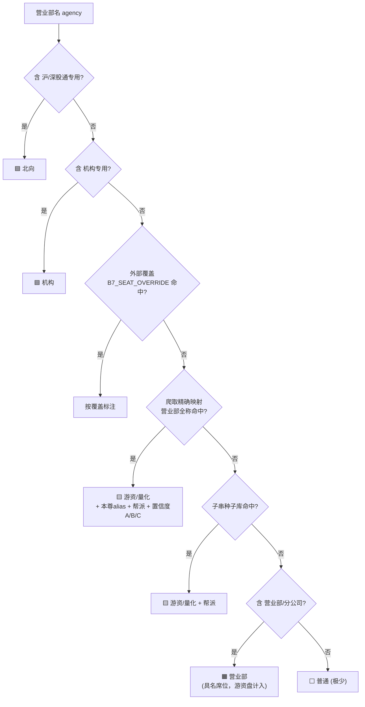
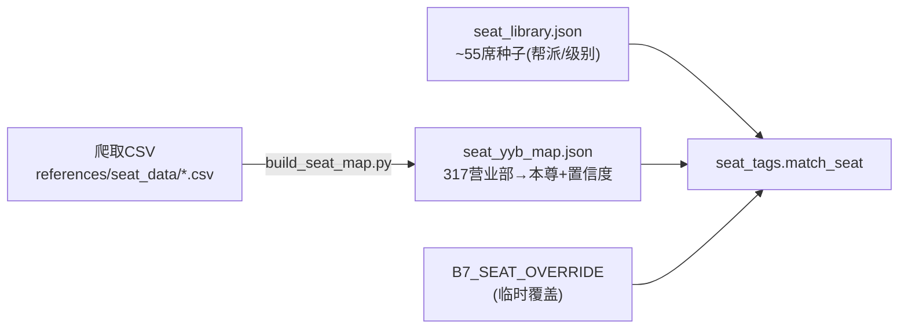

# B7 · 龙虎榜监控 + 席位标签库

> 收盘后自动抓取 A 股龙虎榜，用**席位标签库**把营业部匹配成 北向/机构/游资/量化/营业部（覆盖率≈99%），
> 并接入**爬取的游资本尊库**（317 营业部 → 章盟主·作手新一·消闲派…+ 置信度）。
> 生成**次日关注清单**，每日整理**机构合集 / 营业部合集 / 个股详情页 / 区间统计**，出**交互式 HTML 看板**。
>
> **类型**：监控预警型 BUILD ｜ **数据源**：PandaData ｜ **服务对象**：盘后复盘 agent · 游资情绪 Alpha · 人工复盘

---

## 一句话定位
**今天龙虎榜谁上榜、机构买了啥、哪个游资出手、明天关注谁。**

---

## 🔄 运行流程（一句话 → 落地结果）



---

## 🏷️ 席位标签匹配优先级（核心逻辑）



- **游资盘净买 `hotmoney_net` = 游资 + 营业部**（非机构/非北向/非量化的活跃资金）。
- 标签类型含"量化"（三板组/量化打板/量化基金、外资通道高盛/摩根/中金）→ 归 `量化`，**不计入游资盘**。
- 实测 6/23：245 个席位里仅 2 个落"普通"，68 个拿到真实游资本尊 alias。

---

## 💬 怎么说（自然语言触发）

| 你说 | 它做什么 |
|---|---|
| "跑一下今天龙虎榜" / "龙虎榜监控" | 抓榜 + 席位标签 + 次日清单 + 机构/营业部合集 |
| "明天关注哪些票" | 次日关注清单（打分排序 + 上榜理由） |
| "今天机构买了啥" | 机构合集（机构净买排序） |
| "章盟主 / 作手新一 / 宁波桑田路 今天买了哪些" | 营业部合集，按游资本尊/席位查标的 |
| "看下天娱数科的龙虎榜" | **个股详情页**：按上榜原因拆分，每原因列买入/卖出营业部表（带本尊标签、双金额） |
| "某票最近 3 天/这周区间统计" | **区间统计**：各营业部 总买/总卖/净额/上榜次数，按净额排序 |
| "出个龙虎榜 HTML 看板" | **交互式看板**：tab(股票/机构/营业部) · 搜索 · 筛选 · 列排序 · 点行展开详情 |
| "回填 6 月的龙虎榜" | 区间回填历史（区间统计依赖回填的历史） |

> 一只票一天可能有**多条上榜原因**（如同时涨幅偏离7% + 换手20%），每条原因对应各自一组买入/卖出营业部，详情页分别列出。

## ⚙️ 可选参数（不说走默认）

| 参数 | 默认 | 怎么说 |
|---|---|---|
| 日期 | 最近有数据交易日 | "看 6/18 的"（⏰ 龙虎榜傍晚才公布，**~19:30 后**跑） |
| 输出 | 看问法 | "口头答 / 给表格 / 出 HTML 看板" |
| 席位库 | 见下「席位标签库」 | 重爬刷新 / `B7_SEAT_OVERRIDE` 临时覆盖 |
| 打分权重 | 机构0.35 / 游资0.35 / 净买0.20 / 席位数0.10 | "更看重机构 / 更看重游资" |

---

## 🗃️ 席位标签库（核心资产，两层 + 可维护）



| 层 | 文件 | 内容 | 维护方式 |
|---|---|---|---|
| 爬取精确映射（主） | `scripts/seat_yyb_map.json` | 317 营业部全称 → 游资本尊 alias + 帮派 + 置信度A/B/C + 最近观测 | **重爬**：新 CSV 放 `references/seat_data/` → 跑 `build_seat_map.py` |
| 子串种子库（兜底） | `scripts/seat_library.json` | ~55 席（中信溧阳路·宁波桑田路·欢乐海岸·成都系…）按帮派/级别 | 直接改 JSON |
| 临时覆盖 | env `B7_SEAT_OVERRIDE` | `[{"match","category","tag",...}]` | 不改仓库即生效 |

> ⚠️ 游资别名是**民间观测映射、非券商官方身份、会迁移**——每条带 `confidence`(A/B/C) 与 `last_seen`，C-低不可单独当定论。仅供研究，不构成指认或投资建议。

---

## 📦 输出结构（落地 parquet）

主键 `(trade_date, build_id, target_id, result_type)`，两类行：

| result_type | 一行代表 | 关键字段 |
|---|---|---|
| `lhb_stock` | 一只上榜个股 | `is_watchlist`/`watchlist_rank`/`watch_reason` · `inst_net`/`hotmoney_net`/`north_net` · `n_reasons` · `result_json.reasons`(按上榜原因拆买卖营业部) · `result_json.buy_seats`(带本尊/帮派) |
| `lhb_summary` | 当日 1 行汇总 | `n_lhb` · `n_inst_buy` · `n_hotmoney_buy` · `n_watchlist` · `inst_net_total` |

- 结果落地：`生产产物/database.parquet`（追加合并）
- 看板样例：`生产产物/sample_lhb.html`

---

## ⌨️ 命令行（手动跑）

```bash
export PANDA_USERNAME=<86手机号>; export PANDA_PASSWORD=<密码>
python 开发产物/scripts/build.py --mode daily                 # 当日维护（⏰ ~19:30 后，龙虎榜才出）
python 开发产物/scripts/build.py --mode backfill --start 20260601 --end 20260618
python 开发产物/scripts/render.py                             # 每日整理（markdown）
python 开发产物/scripts/render.py --stock 002354.SZ           # 个股详情页（按上榜原因拆买卖营业部）
python 开发产物/scripts/render.py --stock 002354.SZ --range   # 个股区间统计
python 开发产物/scripts/render_html.py --out lhb.html         # 交互式 HTML 看板
python 开发产物/scripts/render_html.py --stock 002354.SZ --out r.html  # 个股区间统计 HTML
python 开发产物/scripts/build_seat_map.py                     # 重爬后刷新席位本尊库
python 开发产物/scripts/seat_tags.py                          # 自检席位标签库
```

---

## 🗂️ 目录

```text
build-b7-lhb-monitor/
├── README.md                 ← 你在这里
├── 开发产物/
│   ├── SKILL.md              · agent 调用规则 + 字段表
│   ├── skill.json            · 入口清单
│   ├── references/
│   │   ├── api_guide.md      · 接口口径 / 计算公式 / 席位库口径
│   │   └── seat_data/        · 原始爬取席位标签文档(.md/.csv，留档)
│   └── scripts/
│       ├── build.py          · 引擎：抓取/聚合/多上榜原因拆分/次日清单
│       ├── seat_tags.py      · 席位标签匹配（两层库 + 优先级）
│       ├── seat_library.json · 子串种子库
│       ├── seat_yyb_map.json · 爬取的营业部→本尊精确映射
│       ├── build_seat_map.py · CSV→映射 转换器（重爬刷新）
│       ├── render.py         · 每日整理/个股详情/区间统计(markdown)
│       ├── render_html.py    · 交互式 HTML 看板
│       └── test.py           · 单测（含真实数据冒烟）
└── 生产产物/
    ├── SKILL.md              · 生产读取规则
    └── database.parquet      · 结果（每日追加）
```

详细字段口径见 [开发产物/SKILL.md](开发产物/SKILL.md) 与 [开发产物/references/api_guide.md](开发产物/references/api_guide.md)。

---
_借鉴 capital_pricing/seat_analysis 的四类席位逻辑，改为离线可复现（不依赖在线 AI）。仅供研究，不构成投资建议。_
